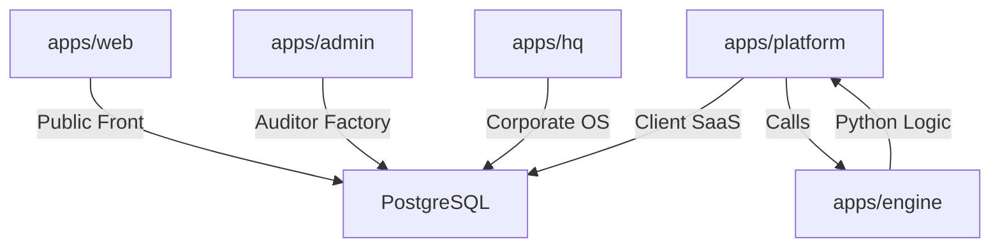

# AIC Pulse: Project Explainer

## 🏛️ Overall Architecture
AIC Pulse is built as a **Turborepo monorepo**, ensuring total synchronization between marketing, customer operations, and internal governance. It leverages **Next.js 16.1.6** across all applications to provide a high-performance, type-safe ecosystem.

### Monorepo Structure

## 🚀 Applications Overview

### 1. `apps/web` (The Front Door)
- **Tech Stack:** Next.js (SSG), Framer Motion, Tailwind.
- **Purpose:** Public education, citizen rights hub, and lead qualification via the interactive assessment quiz.
- **Key Features:** Dynamic Trust Badges, Public Registry, and Citizens' Rights education.

### 2. `apps/platform` (The Portal)
- **Tech Stack:** Next.js (App Router), Recharts, next-auth.
- **Purpose:** Client-facing SaaS where organizations manage their certification roadmap.
- **Key Features:** XAI Factor Attribution visualizers, technical bias audits, and incident resolution queue.

### 3. `apps/admin` (The Factory)
- **Tech Stack:** Next.js, next-auth.
- **Purpose:** Internal operations for lead auditors to verify evidence and manage the audit pipeline.
- **Key Features:** Verification boards, auditor assignments, and cryptographic score sign-offs.

### 4. `apps/hq` (Corporate OS)
- **Tech Stack:** Next.js, Framer Motion.
- **Purpose:** Central command center organizing AIC into five departments: Governance, Operations, Growth, Intelligence, and People.
- **Key Features:** Enterprise CRM, Pipeline Velocity dashboards, and the Lead Auditor Academy.

### 5. `apps/engine` (The Scientist)
- **Tech Stack:** Python (FastAPI), Pandas, SHAP, LIME, Cryptography.
- **Purpose:** The core intelligence layer enforcing algorithmic rights through statistical analysis.
- **Key Features:** Disparate Impact (4/5ths), drift monitoring (PSI), and RSA-3072 cryptographic signing.

## 🔗 Shared Packages
- **`@aic/auth`**: Unified session management and MFA logic.
- **`@aic/ui`**: Executive-grade design system and institutional components.
- **`@aic/legal`**: Continental SADC regulatory mapping registry.
- **`@aic/events`**: Event-driven orchestration definitions.

## ⚖️ Regulatory Stack (Legal Foundation)
AIC is purpose-built for the **South African POPIA Section 71** mandate. Every technical feature—from the hash-chain audit trail to the XAI visualizers—is designed to provide institutional proof of **Meaningful Human Intervention**.

## 🔮 Future Roadmap
- **SADC Expansion:** Moving into Mauritius, Botswana, and Namibia via Mutual Recognition Agreements.
- **Insurance Integration:** Direct actuarial risk-syncing via the insurance ROI API.
- **Lead Auditor Academy Scale:** Training the first 500 certified accountability officers by 2028.

---
**© 2026 AI Integrity Certification (AIC). Confidential Internal Documentation.**
